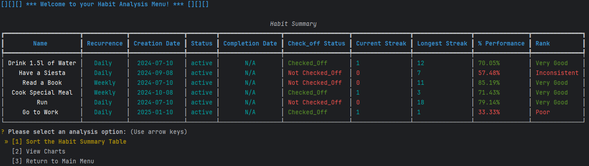
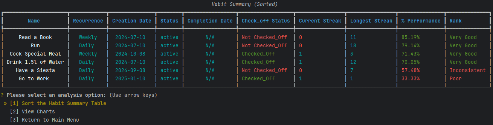
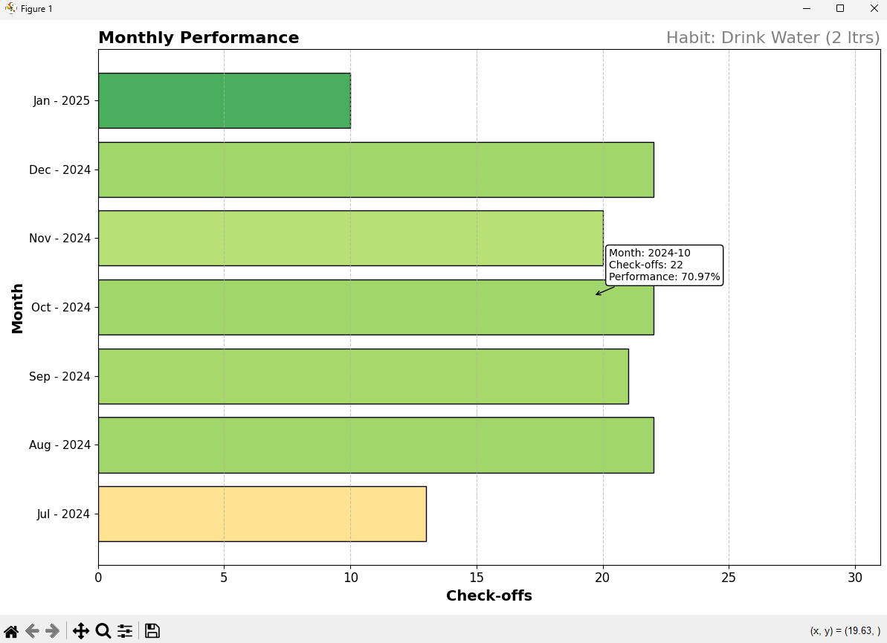
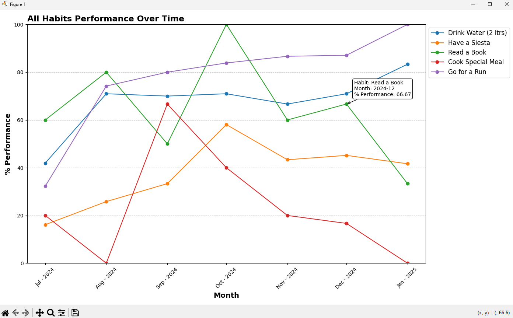
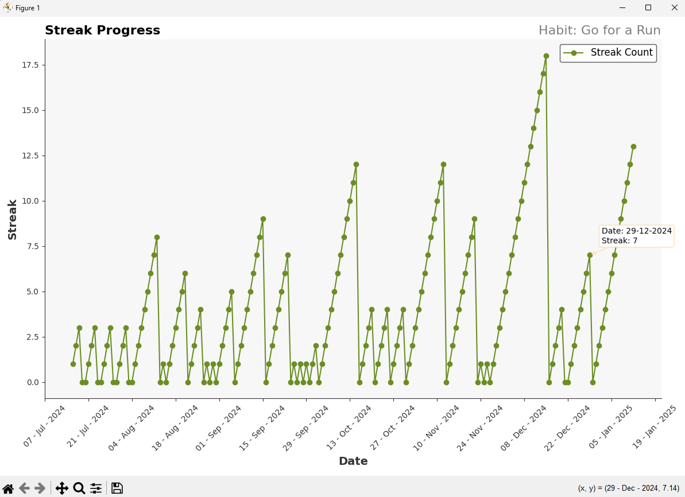
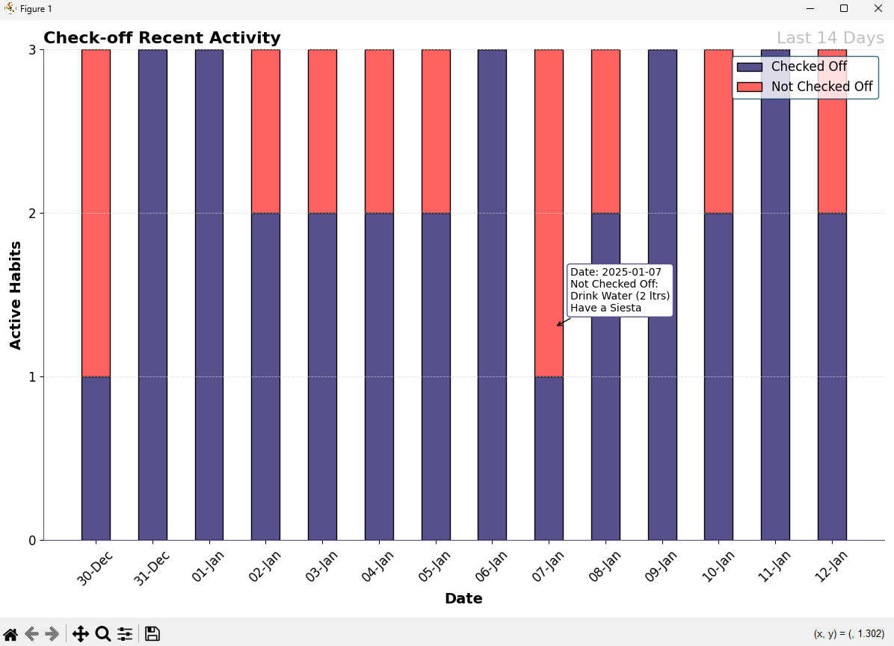
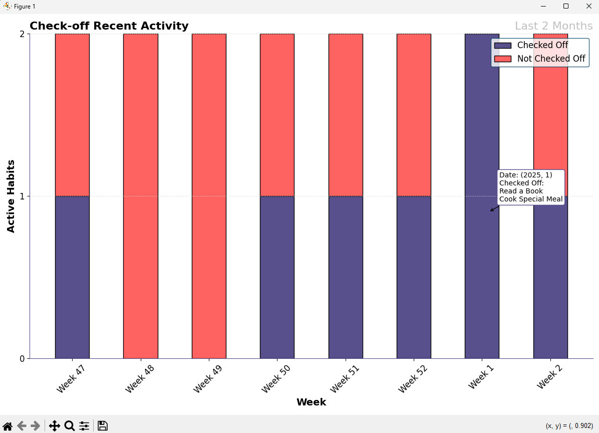

# Habit Tracker App

A fully functional habit tracker app to manage your recurrent habits and improve your lifestyle

## 1. Introduction
This project is the outcome of a university assignment having the purpose to build a simple app following an OOP approach.

While this app has the basic functionalities of a habit tracker, such as the creation, editing, deletion of habits, as well as checking them off in a daily and weekly recurrence,
it does combine the programming-app-development aspect with data analytics, by introducing some interesting graphic visualizations of your habits activity and performance.

Options available from the Analyze section, include:
- The display of a summary table where the user has the ability to sort it by different attributes
- The display of a plot showing how streaks were built and broken across time, for a chosen habit
- The display of monthly performance, as a bar graph, for a chosen habit (measuring the amount of check-offs)
- The graph display of the user's recent check-off activity, contrasting which habits were checked-off vs those that were not

While there is margin for improvement, these graphic displays are interactive and the user has the ability to mouse over to obtain additional details over the selected area.

## 2. Getting Started

### 2.1. Pre-requisites
- Python 3.x
- Sqlite3

### 2.2 Installation
#### Clone the following repository from GitHub:
        https://github.com/Rickveg/HabitTracker.git

### 2.3. Dependencies
        pip install -r requirements.txt

## 3. Usage

### 3.1 Starting the App
Upon setting up your environment and installing the dependencies, run the main.py file from your terminal, 
making sure it's aimed at the correct path directory where the file is. Code to start the app:

        python main.py

### 3.2. First Experience
When running for the first time, the App will welcome you; "show you around" and create 5 predefined habits for you to play around.
As these habits are created, they will be saved into a new database where going forward all your progress will be saved.

### 3.3. Navigating the App
To explore all the app's features, you will interact with the terminal where a menu and submenus will be presented to you, made available through the questionary library.

### 3.4. Managing your Habits
From the *Manage Your Habits* menu, the user may check-off their habits for that day; edit an existing habit; delete a habit or once they feel they are done and have reached their milestones, complete a habit.

### 3.5. Analyzing your Habits
The app comes with some decent functionality and analytical utilities and various chart types, which not only help encourage and highlight the user's progress
and achievements but also to identify potential trends. The different chart types help paint a better and bigger picture of a specific habit or the user's general behaviour over time. 

The *Analyze* menu greets the user with analytical options and displays a summary table straight away as the following:

Note that the user can then choose to sort the summary table by any of the attributes, from the Analyze menu, like by performance as the example below:

Then from the *Charts Menu*, the user can select from different chart types to view their progress. These chart images are interactive (including mouseover functionality) and can be saved locally.

*Chart: Habit Performance*

*Chart: All Habits Performance*

*Chart: Streak Progress*

*Chart: Recent Check-off Activity - Daily Habits*

*Chart: Recent Check-off Activity - Weekly Habits*

In essence, the user may complement the information displayed between the different chart types to answers various questions, such as:
- ***How has Habit X improved (or declined) over time?*** The 'Habit Performance' chart will provide good visuals on the habit's progress since its creation.
- ***How did Habit X perform against other habits?*** The 'All Habits Performance' view may very well show any potential correlation in an improvement/decline against others. E.g. in the month of June most habits declined. Turns out the user went on holiday and wasn't able to keep up with their habits.
- ***When exactly do my streaks break?*** the Streak Progress chart may very well display the user tends to break a habit on weekends and may consequently account and plan for that in the future, should they choose to improve the habit's performance.
- ***How consistent have I been over the past few days/weeks?*** The Check-off Recent Activity charts will easily display on which habits the ball has been dropped or which habits have been checked-off.
- ***...***

## 4. Testing
From your terminal execute the command (ensure path directory is where testing files are):

        pytest

## 5. Known Limitations / Issues
Due to this project's simplistic nature and logic, some features have been thought of and considered but not put in place, at this stage, which can either have an impact on the realistic side of the app, or may instead be simply considered an expansion opportunity. These include:
- User related features: Multiple user creation; login features; first time user validation...
- Advanced habit tracking: setting up targets; flexible recurrences (not being strict to Daily vs Weekly); completion summary...
- Storing and reverting decisions: delete a check-off if the user accidentally checked-off; deleting a habit makes it irreversible and is fully removed from db...